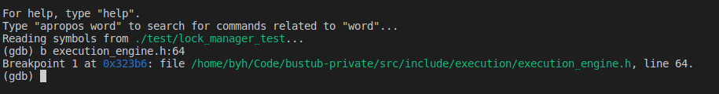

# GDB示例与常见命令

参考链接：

* [cheat sheet](https://darkdust.net/files/GDB%20Cheat%20Sheet.pdf)

* [Debug教程参考](https://www.cs.cmu.edu/~gilpin/tutorial/#3.5)

## 调试delete_executor bug示例

* gdb ./test/lock_manager_test（找到调试的可执行文件，或者使用file添加）
* b execution_engine.h:64（设置断点）

  

* 通过调试分析，第二次进入delete_executor::next函数时会失败
  

* 发现if (child_executor_->Next(tuple, rid)) 报错，深入下去发现：下图中child_executor_->Next(tuple, rid)第二次执行报错，
 

* 继续深入发现：最后一步加锁异常
  

* 发现txn的状态变为了SHRINKING，仔细考虑自身没有在其他地方解锁，怎么会变为shrinking呢？
 

* 查找excutor中代码哪个会解锁，发现系统提供的ApplyDelete会进行解锁。问题找到。
 

## GDB常用技巧
输入tui enable打开窗口如下：

layout src获得源代码：

layout asm 查看汇编代码：

Layout reg可以查看寄存器里面的值，再调试操作系统等基础软件时非常有用：

* 使用focus reg能让视图再reg上翻滚查看

* info breakpoints查看设置的断点

* info frame列出栈的frame
* frame #n 以及 i frame查看具体的栈frame

* bt 查看函数的调用的栈帧和层级关系

* i可用于查看变量，使用p查看具体内存的数值

* i locals 查看变量；watch 变量设置条件；b  … if …