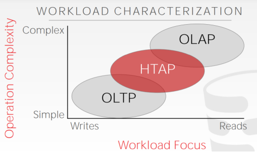
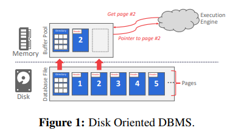
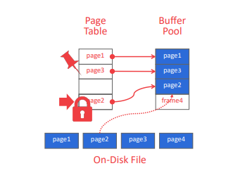

# Database Storage

## 参考笔记
* [ Database Storage (Part I)](https://15445.courses.cs.cmu.edu/fall2020/notes/03-storage1.pdf)

* [Database Storage (Part II)](https://15445.courses.cs.cmu.edu/fall2020/notes/04-storage2.pdf)

## Disk-Oriented DBMS结构：

数据库都在磁盘上，数据库文件中的数据被组织成页（pages），第一页是目录页。 为了对数据进行操作，DBMS 需要将数据带入内存。 它通过一个buffer pool来管理数据在磁盘和内存之间的移动来实现这一点。 DBMS 也有一个执行引擎来执行查询。 执行引擎将向缓冲池请求特定页面，缓冲池将负责将该页面放入内存并为执行引擎提供指向内存中该页面的指针。 缓冲池管理器将确保当执行引擎在该部分内存上运行时页面存在。

## 为什么直接使用操作系统来管理page呢？
如果使用操作系统来实现，需要使用mmap把文件的内容映射到进程的地址空间，使用操作系统自身的功能来完成内存和磁盘间数据的移动。这也意味着当发生也错误，进程会被阻塞。

You never want to use mmap in your DBMS if you need to write。这里是指写入的时候不一定会刷到磁盘吗？所以需要madvise、mlock、msync来辅助。

DBMS知道更多的内部信息，所以能够完成得更好。

## storage manager

DBMS 的存储管理器负责管理数据库的文件。 它将文件表示为页面的集合。 它还跟踪已读取和写入页面的数据以及这些页面中有多少可用空间。

## Page的结构与管理

Todo...

## 数据类型
### System Catalogs
为了让 DBMS 能够破译tuple的内容，它维护了一个内部catalog来告诉
DBMS关于数据库的元数据。 元数据包含table和列中有什么的数据，包括类型和顺序。
大多数 DBMS 以它们用于表的格式将它们的目录存储在它们自己内部。 他们使用特殊代码“bootstrap”这些catalog 表。

## Workloads

OLTP: Online Transaction Processing

OLTP 工作负载的特点是操作快速、运行时间短、查询简单
实体一次，重复操作。 OLTP 工作负载通常会处理比读取更多的写入。

OLAPP: Online Analytical Processing

OLAP 工作负载的特点是运行时间长、查询复杂、读on large portions of the database。 在 OLAP 工作负载中，数据库系统正在从在 OLTP 端收集的现有数据中分析和派生新数据。

## 存储模型

Decomposition Storage Model，列存储非常适合OLAP型的工作负载。由于 DBMS 只读取它需要该查询的数据，因此减少了查询执行期间的浪费工作量。启用更好的压缩，因为同一属性的所有值都是连续存储的。缺点是由于元组拆分/拼接，point queries、插入、更新和删除速度很慢。

# BUFFER POOL

## DMBS访问数据结构

## Bufffer Pool

buffer pool是一个磁盘中pages的在内存中的缓冲区。缓冲池的内存区域组织为一个固定大小的页面数组。每个数组条目称为一个frame。当 DBMS请求一个页面时，一个精确的副本被放置到缓冲池的一个帧中。然后，数据库当请求页面时，系统可以首先搜索缓冲池。 如果未找到该页面，则系统获取一个
从磁盘复制页面。

[具体实现参考：Peoject1](./Project1.md)