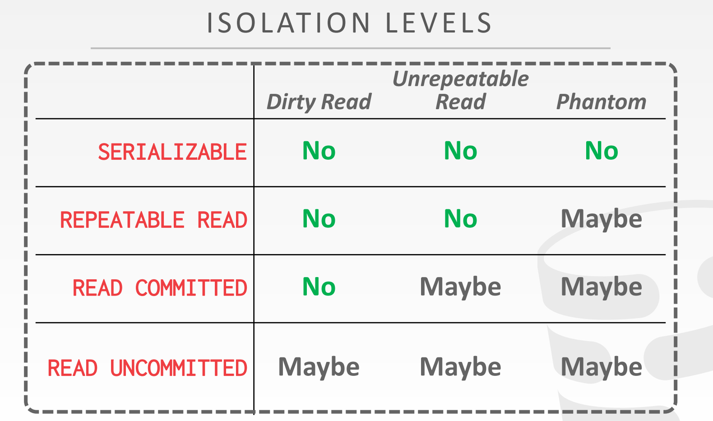
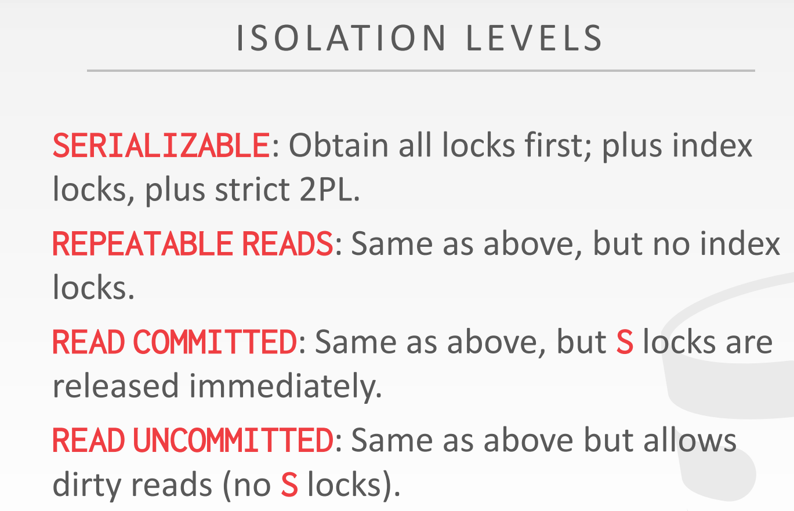

# Concurrency Control

## Transactions
事务是一个或很多操作（比如SQL queries）的一个顺序的执行。是DBMS中改变的最基础的单元。事务必须是atomic。

## transaction理论定义
一个数据库能够表示为一个有名object的集合（A,B,C...）。这些object包含attribute，tuples，pages，tables，甚至是database。算法将研究任意类型的object，但是所有的object是同一种类型。

一个事务是对这些对象的一个序列的读写操作，（R（A），W（B）），**为了简化讨论，假定数据库为固定大小，所以操作只包含读和更新，不包含插入和删除。** 这个会导致**幻读**这一层级的不一致性。

## ACID特性

### Atomicity原子特性：事务所有的操作要么全部执行，要么全部不执行。

* 使用日志：DBMS记录所有操作，所以它能够undo aborted事务的所有操作。它在内存和磁盘上都保留undo记录。
* Shadow Paging：修改副本，实际很少使用。

**MySql 分析：**

### Consistency（一致性）：在事务执行前，当事务是一致性的以及数据库是一致性的，那么当事务完成后数据库也是一致性的。

一致性本事意味着数据库是logically正确的，所有应用问的关于数据的问题将会返回逻辑上正确的结果。

Database Consistency:数据库表示现实生活中的一个实体。

Transaction Consistency:在事务执行前，当以及数据库是一致性的，那么当事务完成后数据库也是一致性的。

### Isolation（隔离性）

DBMS为transactions提供了他们好像单独在系统里面运行的幻觉。等价于事务被按照序列顺序执行。但是为了性能，DBMS会交叉并发事务的执行但是保留了隔离的幻觉。

Concurrency control决定DBMS如何交叉运行这些操作。
* Pessimistic
* Optimistic:DBMS假定事务的冲突很少，所以它会在事务提交后发生冲突时去处理。

execution schedule
* Serial Schedule: Schedule that does not interleave the actions of different transactions.
*  Equivalent Schedules: For any database state, if the effect of execution the first schedule is identical
to the effect of executing the second schedule, the two schedules are equivalent.
* A serializable schedule is a schedule that is equivalent to any serial execution
of the transactions. Different serial executions can produce different results, but all are considered
“correct”.

conflict时在不同事务，执行对相同object的操作，并且至少有一个是写，有如下三种类型的冲突：
* Read-Write Conflicts (“Unrepeatable Reads”): A transaction is not able to get the same value when
reading the same object multiple times.
* Write-Read Conflicts (“Dirty Reads”): A transaction sees the write effects of a different transaction
before that transaction committed its changes.
* Write-Write conflict (“Lost Updates”): One transaction overwrites the uncommitted data of another
concurrent transaction.

### Durability
在崩溃或者重启后，是由已经提交事务的改变必须是durable。使用log或shadow paging确保所有的改变是持久的。

# Two-Phase Locking

DBMS包含一个集中式锁管理器，它决定事务是否可以获取锁。它还提供了一个关于什么在系统运行的全局视图。
事务必须向锁管理器请求锁（或升级）。 锁管理器根据其他事务当前持有的锁（lock_queue_）来授予或block请求。 当事务不再需要释放对象时，它们必须释放锁。 锁管理器使用有关哪些事务持有哪些锁以及哪些事务正在等待获取锁的信息来更新其内部锁表。

是否需要同步到磁盘：
The DBMS’s lock-table does not need to be durable since any transaction that is active (i.e., still running)
when the DBMS crashes is automatically aborted.

两阶段锁（2PL）是一种悲观并发控制协议，它使用锁来确定是否允许事务访问数据库中的对象。 协议不需要知道事务将提前执行的所有查询。

* Phase1：Growing：每个事务申请它在lock manager中需要的锁，lock manager grants/denies这些锁请求。
* Phase2：Shriking：事务在释放第一个锁后立即进入收缩阶段。 在收缩阶段，事务只允许释放锁。 他们不允许获得新的锁。

就其本身而言，2PL 足以保证冲突可串行化。 它生成优先级的时间表图是非循环的。 但它很容易受到 **级联中止（cascading aborts）** 的影响，即事务中止时，现在另一个事务必须回滚，这会导致工作浪费。

## Strong Strict Two-Phase Locking

如果一个事务写入的任何值永远不会被另一个事务读取或覆盖，则调度是strict的，
一直直到第一个事务提交。 Strong Strict 2PL（也称为 Rigorous 2PL）是 2PL 的变体，其中
事务仅在提交时释放锁。

The advantage of this approach is that the DBMS does not incur cascading aborts. The DBMS can also reverse the changes of an aborted transaction by restoring the original values of modified tuples. However, Strict 2PL generates more cautious/pessimistic schedules that limit concurrency.

## 死锁处理
* 死锁检测
* 死锁预防

## 隔离等级与实现方法

四种隔离等级如下：

隔离等级与加锁方法

可以看到RU不用上s锁，所以实际实现中处于READ UNCOMMITED的事务来申请锁，直接回滚事务。这是Lock Manager层面的保证。在实际的执行中，比如在sequential scan的实现中，当访问某一个tuple时，如果是RU隔离等级，那个直接不申请锁。

[具体实现参考：Project4](./Project4.md)